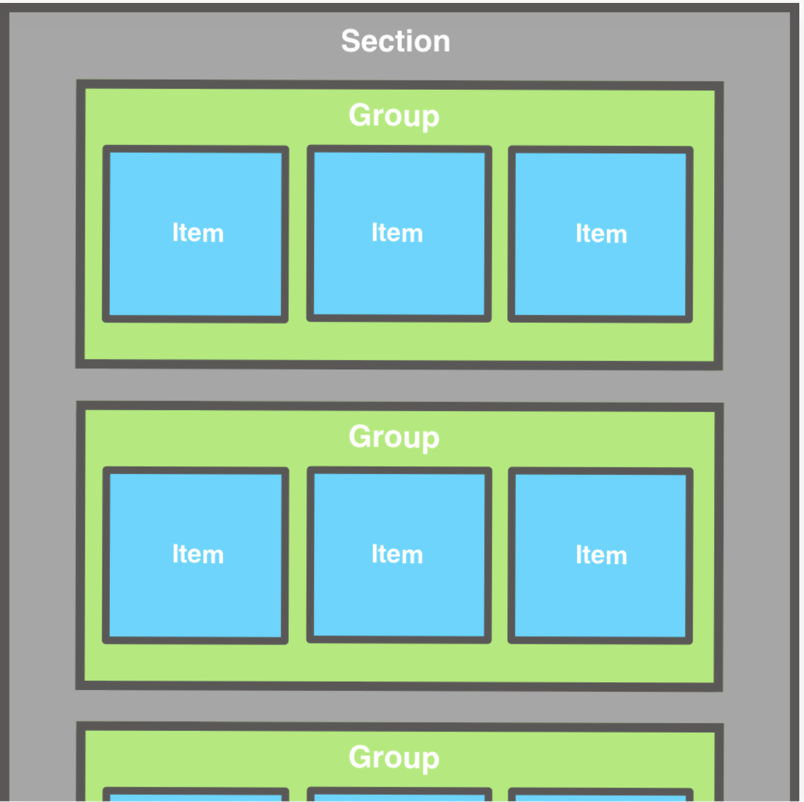

# InstagramFlowLayout
  I want to share with you an example of how to mix UIKit and SwiftUI in your projects. For that, I created a small example called compositional layout. 🧩

## Purpose
InstagramFlowLayout the repo to understand and learn A compositional layout is a type of collection view layout using UICollectionViewCompositionalLayout

## Authors
- Tushar Jaunjalkar

## UICollectionViewCompositionalLayout
UICollectionViewCompositionalLayout is a class in UIKit introduced by Apple in iOS 13.0 that provides a powerful and declarative way to create complex, adaptive layouts for UICollectionViews. It allows you to define your collection view layout using a hierarchical composition of sections, groups, and items. This compositional approach simplifies the creation of dynamic and responsive layouts, making it easier to adapt your app's user interface to different device sizes and orientations.

- Sections: A UICollectionViewCompositionalLayout is composed of one or more sections. Each section represents a logical grouping of items within the collection view.

- Groups: Each section can contain one or more groups. Groups define the layout of items within a section. You can create groups with various layouts, such as a list, a grid, or a custom arrangement, depending on your needs.

- Items: Items represent the individual cells within a group. You can specify item sizes, supplementary views, and decorations for each item.

UICollectionViewCompositionalLayout provides a flexible and efficient approach to defining complex layouts. It's particularly useful for building adaptive layouts that can automatically adjust to different screen sizes and orientations. You can easily create layouts that respond to changes in content or adapt to various device sizes without writing complex code.

## Diagram of a compositional layout with items nested in groups within a section.
